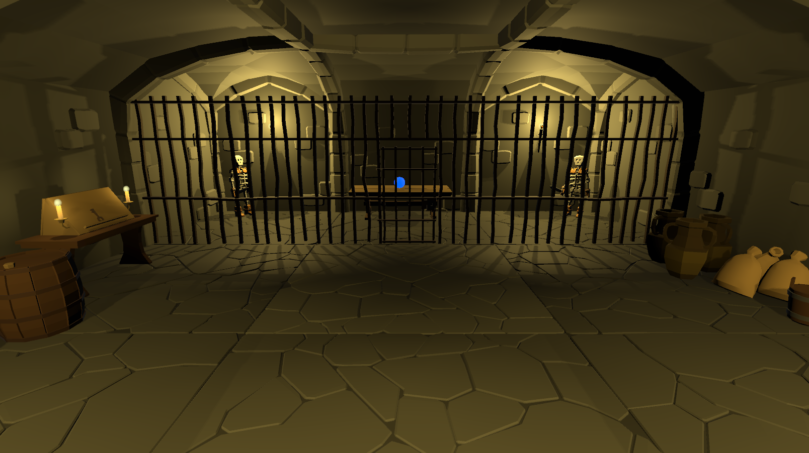

# MagicDungeon-VR-Game

Diese Projekt ist während dem Studium im Modul VRAR entstanden. Zum Antesten wird eine HTC Vive benötigt.

Features:
- Spieler Movement (ausbaufähig)
- Spieler Interaktion mit Objekten (Kisten, Türen, Fässer, Vasen, etc.)
- Aufheben bzw. das Bewegen von Kugeln und Schlüssel zur Öffnung von Passagen
- Düstere Umgebung
- Patrouillierende Skelette
- Tödliche Fallen
- UI (Zeit, Münzen, Tode)
- Sammeln von versteckten Münzen
- Lokales Leaderboard

Packages:
- OpenXR Plugin - Version 1.2.8
- XR Plugin Management - Version 4.0.7
- XR Interaction Toolkit - Version 1.0.0-pre.8

Assets:
- Low Poly Dungeons Lite
- Low Poly Free Dungeon Pack
- Ultimate Low Poly Dungeon
- Low Poly Skeleton
- Low Poly Simple Nature Pack
- Free Low Poly Soaring Ruins
- Free Pixel Font - Thaleah
- Free Skybox Extended Shader
- Awesome Low Poly Fantasy Clouds

Alle erwähnten Assets sind im [Unity Asset Store](https://assetstore.unity.com/) zu finden.

Einige Ausschnitte aus dem Game:

